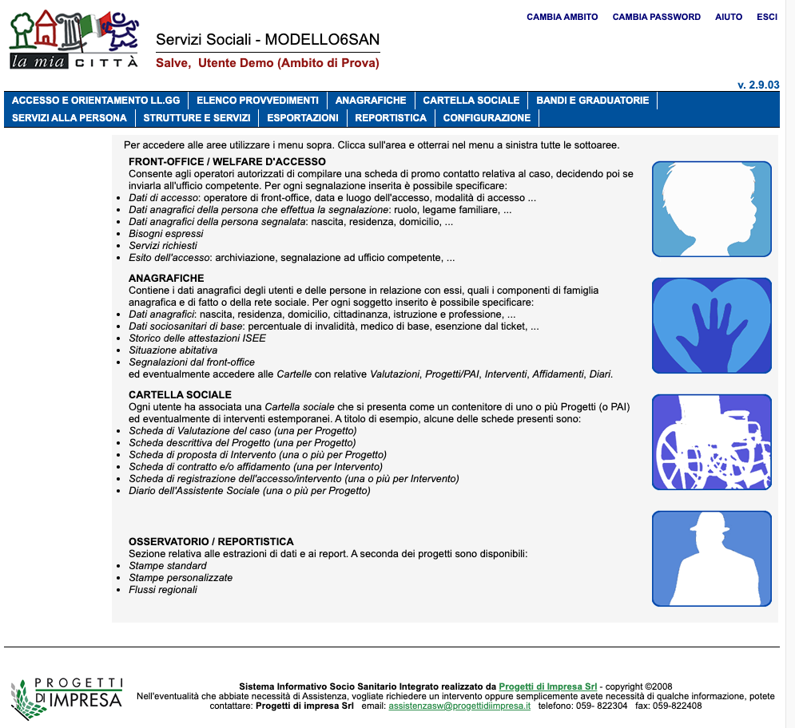
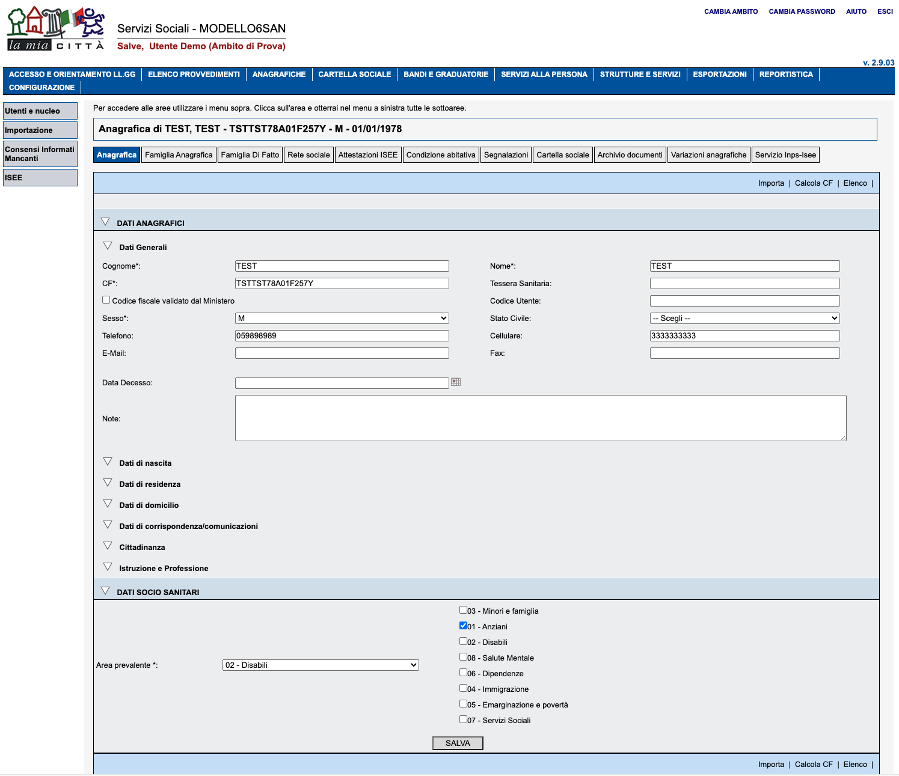

# Software per cartella socio sanitaria "La Mia Città"
Il repository contiene le varie componenti del prodotto "La Mia Città", cartella socio sanitaria, acquisito dal Comune di Bari.

###### In questo repository si trovano o si troveranno le varie componenti della suite applicativa "La Mia Città", che comprende nel suo complesso:
- un backoffice di configurazione
- un front end web con le funzionalità di cartella socio sanitaria
- altre webapp di corredo, come l'inserimento veloce di interventi per servizi a fruizione diffusa

Al momento l'unica componente della suite è la parte client della webapp di inserimento veloce di interventi

##### L'applicazione web ha le seguenti funzionalità di base:
- segretariato sociale / punto unico d'accesso
- anagrafica assistiti con gestione delle famiglie e reti amicali
- cartella socio sanitaria con progetti, interventi, provvedimenti e accessi
- vari altri moduli tra cui bandi e graduatorie, servizi alla persona, reportistica

##### Schermate di esempio del prodotto:
Menu principale gestionale

Anagrafica gestionale

### Link alla pagina del prodotto:
https://www.ai4health.ai/servizi/Menu/dinamica.aspx?idSezione=23760&idArea=23764&idCat=23784&ID=23784&TipoElemento=categoria

### link ad eventuale documentazione aggiuntiva non inclusa nel presente repository
Attualmente non presente

### Organizzazione del repository
Il repository è organizzato per componente della suite.
Sono state utilizzate varie tecnologie negli anni per sviluppare le parti della suite perciò ogni cartella della suite è organizzata al suo interno in accordo alla tecnologia usata per sviluppare la singola parte in oggetto.

Ad esempio la cartella sfd, prima ad essere pubblicata in questo repository, contiene il progetto della parte client della webapp per l'inserimento veloce di interventi

### elenco dettagliato prerequisiti e dipendenze
All'interno di ogni cartella è presente un file README che documenta, tra le altre cose, prerequisiti e dipendenze del progetto contenuto.
Ad oggi la somma dei prerequisiti e dipendenze delle varie componenti è come segue:

Inserimento veloce degli interventi
Librerie principali:
- Node.js v14
- React v16.14
- Axios 0.18.1
- Redux 4.0.5
- React-router 5.2.0
- Altre librerie dettagliate nel file package.json della cartella principale del progetto

In particolare non sono presenti dipendenze da software commerciali.

Il progetto può essere compilato sotto Windows e MacOS e l'output di build consta di file statici da inserire in una sottocartella del web server.

### istruzioni per l’installazione
Questa informazione varia per ogni componente della suite.
Ogni sottocartella contenente un progetto ha un suo file README.md contenente tra le altre cose le seguenti informazioni:

- procedura di installazione di requisiti e dipendenze
- build system (se previsto dal progetto)
- comandi per la compilazione o il deployment

### eventuali indicazioni sullo status del progetto
Al momento il repository non è completo, le componenti sono in fase di rilascio su questo repository e quelle già rilasciate sono:
- parte client della webapp per l'inserimento veloce di interventi (Servizi a Fruizione Diffusa) (STABILE)

### link ad eventuali sistemi di Continuous Integration (TravisCI, CircleCI), code coverage (copertura del codice) ed altre metriche associati al repository
non presenti

### documentazione relativa all’eventuale utilizzo di sistemi per semplificare e accelerare il deployment in ambiente di sviluppo, test e produzione
non presenti

### nomi dei detentori di copyright, ovvero l’Amministrazione committente

Comune di Bari

### Licenza
Il software distribuito in questo repository è distribuito secondo la licenza GNU AFFERO GENERAL PUBLIC LICENSE tranne ove indicato diversamente.
https://spdx.org/licenses/AGPL-3.0-or-later.html

Al momento non sono presenti sul repository parti della soluzione coperte da licenze differenti.

### nomi dei soggetti incaricati del mantenimento del progetto open source
AI4Health srls

### indirizzo e-mail a cui inviare segnalazioni di sicurezza
daniele.bergonzini@ai4health.ai
