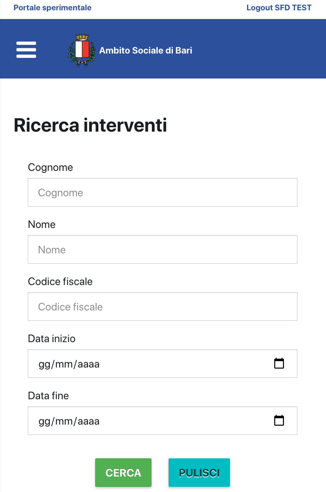

# Servizi a fruizione diffusa - parte client
Il repository contiene la parte client dell'applicativo "Servizi a fruizione diffusa" del prodotto "La Mia Città".

### contesto di utilizzo e casi d’uso

L'applicativo "Servizi a fruizione diffusa" è utilizzato per l'attivazione veloce di interventi socio-sanitari multipli su singolo assistito.
Tramite esso un operatore accreditato può attivare uno o più interventi di assistenza socio-sanitaria, così come definiti sulla suite "La Mia Città" a favore di un assistito.
Si tiene conto della presenza del nucleo familiare, di soggetti con caratteristiche di fragilità e di invalidità.

Le Web API su cui si appoggia questa parte client sono descritte in dettaglio nella documentazione che si trova nella sotto-cartella docs/webservice della cartella principale di questo progetto.

##### L'applicazione web ha le seguenti funzionalità di base:
- attivazione di uno o più interventi socio-sanitari su assistito
- modifica dei dati di un intervento

##### Schermate di esempio del prodotto:

L'interfaccia è basata su Bootstrap 3:

### Link alla pagina del prodotto:
https://servizisociali.comune.bari.it/sfd/

### link ad eventuale documentazione aggiuntiva non inclusa nel presente repository

Attualmente non presente

### Organizzazione del repository
Questa cartella del repository segue la struttura dei progetti creati con "Create React App" (https://create-react-app.dev/)
In più sono presenti:
- una cartella docs che contiene la documentazione di un piccolo framework per la gestione dei form scritto ad hoc per il progetto (FormModelManager.txt) e le specifiche dei web service chiamati da questa parte client
- una cartella images per le immagini relative al presente documento

### elenco dettagliato prerequisiti e dipendenze

Librerie principali:
- Node.js v14
- React v16.14
- Axios 0.18.1
- Redux 4.0.5
- React-router 5.2.0
- Altre librerie dettagliate nel file package.json della cartella principale del progetto

In particolare non sono presenti dipendenze da software commerciali.

Il progetto può essere compilato sotto Windows e MacOS e l'output di build consta di file statici da inserire in una sottocartella del web server.

Per lo sviluppo è stato utilizzato Visual Studio Code, v. 1.4 e successivi.

### istruzioni per l’installazione

procedura di installazione di requisiti e dipendenze:
avendo installato Node 14, aprire un terminale nella directory principale di questo progetto e lanciare il seguente comando:
npm install

a questo punto occorre anche editare il file:
.env (nel caso di ambiente di produzione)
.env.local (nel caso di ambiente di test locale)
e inserire nella variabile "REACT_APP_API_URL" l'URL di base per i web service.

In src/redux/reducer.js occorre modificare la riga che attualmente è così:
const DEFAULT_LOGIN_TOKEN = "SOSTITUIRE";
con:
const DEFAULT_LOGIN_TOKEN = "68B100FC-41D5-4AEF-8BCE-87D95E29C748";

In src/shared/constants si può, se necessario, modificare la costante WS_ENDPOINTS per definire la parte finale dell'URL da chiamare per i web service.
La concatenazione del valore di REACT_APP_API_URL e del sotto oggetto di WS_ENDPOINTS identifica l'URL del web service.

Infine in package.json si può modificare la voce "homepage" per farla concidere con l'URL a cui andare per utilizzare la presente applicazione web.

build system:

Trattandosi di un progetto creato con "Create React App" sono presenti i seguenti comandi da eseguire in un terminale nella cartella principale di questa parte di repository:
"npm start" per il test locale
"npm run build" per compilare il progetto (i file compilati e pronti per il deploy si troveranno dunque nella cartella build)

### eventuali indicazioni sullo status del progetto

Il progetto è stato rilasciato e in status STABILE. 
In questa cartella si trova solo la parte client, quella con i web service è ancora in fase di pubblicazione.

### link ad eventuali sistemi di Continuous Integration (TravisCI, CircleCI), code coverage (copertura del codice) ed altre metriche associati al repository

non presenti

### documentazione relativa all’eventuale utilizzo di sistemi per semplificare e accelerare il deployment in ambiente di sviluppo, test e produzione

non presenti

### nomi dei detentori di copyright, ovvero l’Amministrazione committente

Comune di Bari

### nomi dei soggetti incaricati del mantenimento del progetto open source

AI4Health srls

### indirizzo e-mail a cui inviare segnalazioni di sicurezza

daniele.bergonzini@ai4health.ai
